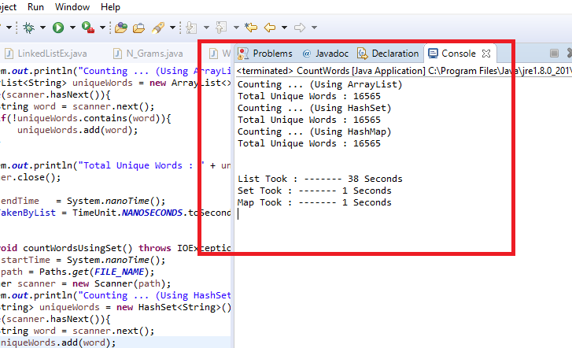

# Data-Structures

### List
1. ArrayList
2. LinkedList

#### (1) ArrayList
##### Key points:
  - Resizable
  - Allow retrieving elements by their index
  - Orderd collection
  - Allows Duplicate and null values

##### Trade Off:
  - Dose not support inserting data in the middle of the list
  - Dose not support primitive types

##### [Details and Methods](https://docs.oracle.com/javase/8/docs/api/java/util/ArrayList.html)

#### (2) LinkedList
##### Key points:
  - Almost like ArrayList
  - Internally way of storing data is different
  - It store an object called "nodes" which connect each other and form a chain
  - Allow inserting data in the middle of the list

##### Trade Off:
  - Uses more overall memory than a ArrayList
  - Slower when looking up a value in a random index

##### [Details and Methods](https://docs.oracle.com/javase/7/docs/api/java/util/LinkedList.html)

#### List Example: [ArrayList vs LinkedList](https://github.com/Apurba000Biswas/Data-Structures/blob/master/src/practise_set_1/ListExample.java)

### ADTs: (Abstruct Data Type)
The idea of different way of implementing same operation is called ADT.
1. Stack
2. Queue

#### (1) Stack
##### Key points:
  - Last In First Out (LIFO)
  - push : Add an element to the TOP
  - pop : Remove the TOP element
  - peek : Examine the TOP element (Dose not remove it)

##### Trade Off:
  - Dose not allow to see how many elements in a stack

##### [Details and Methods](https://docs.oracle.com/javase/7/docs/api/java/util/Stack.html)

#### (2) Queue
##### Key points:
  - First In First Out (FIFO)
  - add : Add an element to the BACK of the queue(AKA: enqueue)
  - remove : Remove an element from the FRONT of the queue (AKA: dequeue)
  - peek : Examine the FRONT element (Dose not remove it)

##### Trade Off:
  - Dose not allow to see how many elements in a queue

##### [Details and Methods](https://docs.oracle.com/javase/7/docs/api/java/util/Queue.html)

#### ADT Example: [Stack vs Queue](https://github.com/Apurba000Biswas/Data-Structures/blob/master/src/practise_set_1/ADT_Example.java)

### Set
A Collection of unique values. We dont think of a set as having any indexes.
We just add things the set in general.
##### Key points:
  - No duplicate value allowed
  - Perform Add, Remove, Search(Contain) operations

##### [Details and Methods](https://docs.oracle.com/javase/7/docs/api/java/util/Set.html)
#### Set Example: [Set](https://github.com/Apurba000Biswas/Data-Structures/blob/master/src/practise_set_1/SetExample.java)

### Map
A Collection that stores pairs, where each pair consists of first half called "Key" and second half called "Value"
##### Key points:
  - Sometimes called "dictionary/ associative array/ hash"
  - Basic operations put, get, remove

##### [Details and Methods](https://docs.oracle.com/javase/8/docs/api/java/util/Map.html)
#### Map Example: [Map](https://github.com/Apurba000Biswas/Data-Structures/blob/master/src/practise_set_1/MapExample.java)

## Performance Analysis (List vs Set vs Map)
Reading a Long Text file word by word List took pretyy long time than Set or Map, wheather Set and Map took almost same time.
Note: every word is unique word.
The program tested on Intel Core i3 processor with 3.30 GHz in 12 Gigs of Ram.
#### Screen Shot 1:

  

#### Screen Shot 2:

  

#### Screen Shot 3:

  

### [Program Link - (CountWords)](https://github.com/Apurba000Biswas/Data-Structures/blob/master/src/practise_set_1/CountWords.java)

Acknowledgement
-----------------

Stanford(CS-106A) : http://stanford.edu/class/archive/cs/cs106b/cs106b.1184/index.shtml

Authors
--------------

[Apurba Biswas](https://github.com/Apurba000Biswas)
